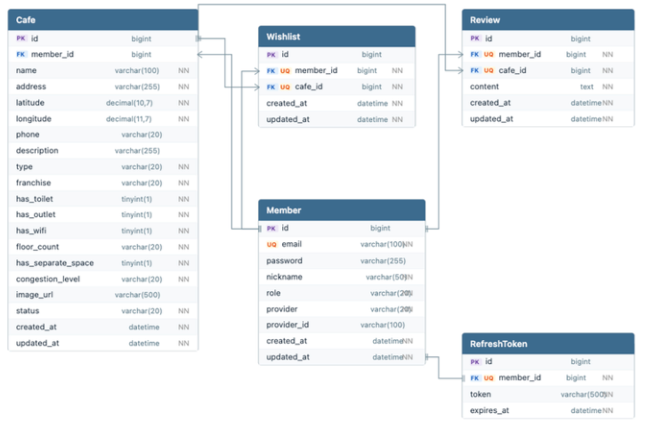

# NBE9-11-2-Team11
백엔드 11기 2차 11팀 프로젝트 - 열일하조

# ☕ 카공데이 - 지도 기반 카페 탐색 서비스

> 카카오맵 기반으로 카공하기 좋은 카페를 탐색하고, 찜·리뷰·제보 기능과 관리자 운영 기능을 제공하는 웹 서비스
 
---

## 📌 프로젝트 소개


카페를 학습 공간으로 활용하는 **카공족**이 늘어나고 있지만, 기존 카페 서비스는 위치·메뉴 등 기본 정보 중심으로 제공되어 공부나 작업에 적합한 카페인지 방문 전에 판단하기 어려웠습니다.

카공데이는 이러한 불편함을 해결하기 위해, 혼잡도·콘센트·분리된 공간 등 **카공 환경 정보를 지도 기반으로 직관적으로 제공**하고사용자가 직접 카페를 제보해 **최신 정보를 함께 만들어 나가는 서비스**입니다.

---


## 💡 주요 기능

### 로그인
- 카카오 OAuth2 기반 소셜 로그인
- JWT 발급 및 HttpOnly Cookie 기반 인증 상태 유지
- Access Token / Refresh Token 관리
- 관리자 권한에 따른 페이지 접근 제어

### 지도
- 카카오맵 SDK 기반 메인 화면 제공
- 지도 마커 및 클러스터러 표시
- 카페 상세 패널 연동
- 검색 및 필터 기능 제공

### 카페
- 카페 목록 조회 / 상세 조회
- 카페 등록 / 제보
- 카페 삭제 및 승인 대기 관리
- 공통 DTO 구조 적용 (`CafeBaseInfo`, `CafeRequest`)

### 찜 & 리뷰
- 카페 찜 추가 / 취소 / 목록 조회
- 리뷰 생성 / 조회 / 수정 / 삭제
- 작성자 본인 또는 관리자만 수정/삭제 가능
- 페이징 처리 기반 조회 최적화

### 관리자
- 관리자 로그인
- 관리자 전용 페이지 접근 제어
- 카페 등록 / 삭제 / 승인 관리
- 관리자 API 호출 공통화

---

## 👥 팀원 소개

| 이름  | 담당                                                      |
|-----|---------------------------------------------------------|
| 최동현 | 팀장, 백엔드 - 관리자 카페 정보 CRUD 및 유저 제보 <br/>프론트 - 필터링 모달      |
| 서준우 | 백엔드 - 카페 리뷰 CRUD <br/>프론트 - 로그인 페이지, 리뷰 수정              |
| 안수빈 | 백엔드 - JWT 기반 사용자 인증/인가 및 토큰 관리 구현 <br/>프론트 - 관리자 페이지 구현 |
| 이형진 | 백엔드 - 사용자 OAuth, 관리자 로그인 구현 <br/>프론트 - 관리자 로그아웃 구현      |
| 최민규 | 백엔드 - 카페 목록/단건 검색, 찜 기능 구현 <br/>프론트 - 맵 연동 및 기본 화면 틀 구현 |

---

## 🛠 기술 스택

### Backend


### Frontend


### External API / Infra


---

## 📁 프로젝트 구조
### 백엔드
```
backend/
├── src/
│   ├── main/
│   │   ├── java/com/back/team11/
│   │   │   ├── domain/
│   │   │   │   ├── member/
│   │   │   │   │   ├── entity/
│   │   │   │   │   │   ├── Member.java                    # Entity
│   │   │   │   │   │   ├── MemberRole.java                # Enum - ADMIN / USER
│   │   │   │   │   │   └── Provider.java             # Enum - LOCAL / KAKAO
│   │   │   │   │   ├── repository/
│   │   │   │   │   │   └── MemberRepository.java          # Repo
│   │   │   │   │   ├── service/
│   │   │   │   │   │   └── MemberService.java             # Service
│   │   │   │   │   ├── controller/
│   │   │   │   │   │   └── MemberController.java          # Controller
│   │   │   │   │   └── dto/
│   │   │   │   │       ├── MemberRequestDto.java          # DTO
│   │   │   │   │       └── MemberResponseDto.java         # DTO
│   │   │   │   │
│   │   │   │   ├── cafe/
│   │   │   │   │   ├── batch/
│   │   │   │   │   │   ├── dto/
│   │   │   │   │   │   │   ├── KakaoPlaceDto
│   │   │   │   │   │   │   ├── KakaoSearchResponse
│   │   │   │   │   │   ├── CafeApiItemReader.java         # Batch
│   │   │   │   │   │   ├── CafeCollectJobConfig.java      # Batch
│   │   │   │   │   │   └── CafeItemProcessor.java         # Batch
│   │   │   │   │   ├── entity/
│   │   │   │   │   │   ├── Cafe.java                      # Entity
│   │   │   │   │   │   ├── CafeType.java                  # Enum - FRANCHISE / INDIVIDUAL
│   │   │   │   │   │   ├── Franchise.java                 # Enum - STARBUCKS / MEGA_COFFEE / NONE
│   │   │   │   │   │   ├── CafeStatus.java                # Enum - PENDING / APPROVED / REJECTED
│   │   │   │   │   │   ├── FloorCount.java                # Enum - ONE / TWO / THREE_OR_MORE
│   │   │   │   │   │   └── CongestionLevel.java           # Enum - LOW / MEDIUM / HIGH
│   │   │   │   │   ├── repository/
│   │   │   │   │   │   ├── CafeRepository.java            # Repo
│   │   │   │   │   │   ├── CafeRepositoryCustom.java      # Repo
│   │   │   │   │   │   ├── CafeRepositoryImpl.java        # Repo
│   │   │   │   │   │   └── CafeSearchCondition.java       # Repo
│   │   │   │   │   ├── service/
│   │   │   │   │   │   ├── CafeService.java               # Service
│   │   │   │   │   │   └── AdminCafeService.java          # Service
│   │   │   │   │   ├── controller/
│   │   │   │   │   │   ├── AdminCafeController.java       # Controller
│   │   │   │   │   │   ├── CafeController.java            # Controller
│   │   │   │   │   │   └── CafeSearchController.java      # Controller
│   │   │   │   │   └── dto/
│   │   │   │   │       ├── AdminCafeResponse.java         # DTO
│   │   │   │   │       ├── AdminCafeSearchCondition.java  # DTO
│   │   │   │   │       ├── CafeBaseInfo.java              # DTO
│   │   │   │   │       ├── CafeDetailResponse.java        # DTO
│   │   │   │   │       ├── CafeListResponse.java          # DTO
│   │   │   │   │       ├── CafeRequest.java               # DTO
│   │   │   │   │       ├── CafeResponse.java              # DTO
│   │   │   │   │       ├── CafeUpdateRequest.java         # DTO
│   │   │   │   │       └── PageResponse.java              # DTO - 검색 필터
│   │   │   │   │
│   │   │   │   ├── review/
│   │   │   │   │   ├── entity/
│   │   │   │   │   │   └── Review.java                    # Entity
│   │   │   │   │   ├── repository/
│   │   │   │   │   │   └── ReviewRepository.java          # Repo
│   │   │   │   │   ├── service/
│   │   │   │   │   │   └── ReviewService.java             # Service
│   │   │   │   │   ├── controller/
│   │   │   │   │   │   └── ReviewController.java          # Controller
│   │   │   │   │   └── dto/
│   │   │   │   │       ├── ReviewRequestDto.java          # DTO
│   │   │   │   │       └── ReviewResponseDto.java         # DTO
│   │   │   │   │
│   │   │   │   └── wishlist/
│   │   │   │       ├── entity/
│   │   │   │       │   └── Wishlist.java                  # Entity
│   │   │   │       ├── repository/
│   │   │   │       │   └── WishlistRepository.java        # Repo
│   │   │   │       ├── service/
│   │   │   │       │   └── WishlistService.java           # Service
│   │   │   │       ├── controller/
│   │   │   │       │   └── WishlistController.java        # Controller
│   │   │   │       └── dto/
│   │   │   │           └── WishlistResponse.java          # DTO
│   │   │   │
│   │   │   ├── auth/
│   │   │   │   ├── entity/
│   │   │   │   │   └── RefreshToken.java                  # Entity
│   │   │   │   ├── repository/
│   │   │   │   │   └── RefreshTokenRepository.java        # Repo
│   │   │   │   ├── service/
│   │   │   │   │   ├── AuthService.java    
│   │   │   │   │   ├── TokenReissueService.java    
│   │   │   │   │   └── TokenService.java                  # Service
│   │   │   │   ├── controller/
│   │   │   │   │   ├── AdminAuthController.java    
│   │   │   │   │   ├── AuthController.java    
│   │   │   │   │   └── TokenReissueController.java        # Controller
│   │   │   │   ├── dto/
│   │   │   │   │   ├── LoginRequestDto.java               # DTO - 관리자 로컬 로그인
│   │   │   │   │   └── TokenResponseDto.java              # DTO - JWT 토큰
│   │   │   │   └── oauth/
│   │   │   │       ├── CustomOAuth2UserService.java       # Serivce
│   │   │   │       ├── OAuth2SuccessHandler.java          
│   │   │   │       └── OAuthAttributes.java               
│   │   │   │
│   │   │   ├── security/
│   │   │   │   ├── SecurityConfig.java                    # Config
│   │   │   │   ├── JwtTokenProvider.java                  # Security
│   │   │   │   ├── JwtAuthenticationFilter.java           # Security
│   │   │   │   ├── CustomUserDetails.java                 # Security
│   │   │   │   └── CustomUserDetailsService.java          # Security
│   │   │   │
│   │   │   └── global/
│   │   │       ├── config/
│   │   │       │   ├── QueryDslConfig.java                # Config
│   │   │       │   └── SwaggerConfig.java                 # Config
│   │   │       ├── dto/
│   │   │       │   ├── PageResponse.java                  # dto
│   │   │       ├── exception/
│   │   │       │   ├── GlobalExceptionHandler.java
│   │   │       │   ├── ErrorCode.java
│   │   │       │   └── CustomException.java
│   │   │       ├── rsData
│   │   │       │   └── RsData.java                         # 공통 응답 래퍼
│   │   │       └── util/
│   │   │           ├── CookieUtil.java                    # RefreshToken 추가
│   │   │           └── AutiUtil.java                      # Config 
│   │   │
│   │   └── resources/
│   │       ├── application.yaml                           # 공통
│   │       └── data.sql                                   # 공통
│   │
│   └── test/java/com/back/team11/
│       ├── domain/
│       │   ├── auth/
│       │   │   ├── AdminAuthControllerTest.java
│       │   │   ├── AuthControllerTest.java
│       │   │   └── TokenReissueControllerTest.java
│       │   ├── cafe/
│       │   │   ├── AdminCafeControllerTest.java
│       │   │   ├── CafeControllerTest.java
│       │   │   └── CafeSearchControllerTest.java
│       │   ├── review/
│       │   │   └── ReviewControllerTest.java
│       │   └── wishlist/
│       │       └── WishlistControllerTest.java
│       └── BackendApplicationTests.java
│
├── build.gradle
└── settings.gradle
```

### 프론트엔드
```
frontend/
├── .next/
├── node_modules/
├── public/
├── src/
│   ├── app/
│   │   ├── api/
│   │   │   ├── search/
│   │   │   │   └── route.ts
│   │   │   ├── auth.ts
│   │   │   └── client.ts
│   │   ├── login/
│   │   │   └── page.tsx
│   │   ├── login-success/
│   │   │   └── page.tsx
│   │   ├── main/
│   │   │   ├── admin/
│   │   │   │   ├── cafe/
│   │   │   │   │   └── page.tsx
│   │   │   │   ├── login/
│   │   │   │   │   └── page.tsx
│   │   │   │   ├── pending/
│   │   │   │   │   └── page.tsx
│   │   │   │   └── rejected/
│   │   │   │       └── page.tsx
│   │   │   ├── cafe/
│   │   │   │   └── [id]/
│   │   │   │       └── page.tsx
│   │   │   ├── wishlist/
│   │   │   │   └── page.tsx
│   │   │   └── page.tsx
│   │   ├── oauth/
│   │   │   └── callback/
│   │   │       └── page.tsx
│   │   ├── favicon.ico
│   │   ├── globals.css
│   │   ├── layout.tsx
│   │   └── page.tsx
│   │
│   ├── components/
│   │   ├── admin/
│   │   │   ├── CafeCreateModal.tsx
│   │   │   ├── CafeDetailModal.tsx
│   │   │   ├── CafeEditModal.tsx
│   │   │   ├── CafeFormFields.tsx
│   │   │   ├── CafeList.tsx
│   │   │   ├── Logoutbutton.tsx
│   │   │   ├── page.tsx
│   │   │   ├── PaginationButtons.tsx
│   │   │   ├── PendingList.tsx
│   │   │   └── RejectedList.tsx
│   │   ├── cafe/
│   │   │   ├── CafeDetail.tsx
│   │   │   ├── page.tsx
│   │   │   ├── PopularCafeList.tsx
│   │   │   ├── ReportModal.tsx
│   │   │   └── WishlistPanel.tsx
│   │   ├── common/
│   │   │   ├── FilterModal.tsx
│   │   │   ├── Header.tsx
│   │   │   ├── page.tsx
│   │   │   └── SearchModal.tsx
│   │   ├── map/
│   │   │   ├── Map.tsx
│   │   │   └── page.tsx
│   │   └── review/
│   │       └── page.tsx
│   │
│   ├── hooks/
│   │   └── page.tsx
│   │
│   ├── lib/
│   │   └── api/
│   │       ├── admin.ts
│   │       ├── auth.ts
│   │       └── cafe.ts
│   │
│   ├── store/
│   │   └── authStore.ts
│   │
│   ├── types/
│   │   ├── admin.ts
│   │   ├── cafe.ts
│   │   └── kakao.d.ts
│   │
│   └── proxy.ts
│
├── .env.local
├── .gitignore
├── eslint.config.mjs
├── next-env.d.ts
├── next.config.ts
├── package-lock.json
├── package.json
├── postcss.config.mjs
├── README.md
├── tailwind.config.ts
└── tsconfig.json
```

🗄 ERD



## 🚀 실행 방법

### Backend
**1. 레포지토리 클론**
```bash
git clone https://github.com/prgrms-be-devcourse/NBE9-11-2-Team11.git
cd NBE9-11-2-Team11/backend
```

**2. application.yaml 설정**
```yaml
spring:
  application:
    name: backend

  config:
    import: optional:file:.env[.properties]

  datasource:
    url: jdbc:mysql://localhost:3306/cafe_study?serverTimezone=Asia/Seoul&characterEncoding=UTF-8
    username: ${DB_USERNAME}
    password: ${DB_PASSWORD}
    driver-class-name: com.mysql.cj.jdbc.Driver

  sql:
    init:
      mode: always

  jpa:
    hibernate:
      ddl-auto: update
    properties:
      hibernate:
        dialect: org.hibernate.dialect.MySQLDialect
        format_sql: true
        show_sql: true
    defer-datasource-initialization: true

  security:
    oauth2:
      client:
        registration:
          kakao:
            client-id: ${CLIENT_ID}
            authorization-grant-type: authorization_code
            redirect-uri: "http://localhost:8080/api/V1/auth/oauth/kakao/callback"
            client-name: Kakao
            scope:
              - profile_nickname
              - profile_image


        provider:
          kakao:
            authorization-uri: https://kauth.kakao.com/oauth/authorize
            token-uri: https://kauth.kakao.com/oauth/token
            user-info-uri: https://kapi.kakao.com/v2/user/me
            user-name-attribute: id
  batch:
    job:
      enabled: true # 서버 시작시 자동실행

jwt:
  secret: ${JWT_SECRET}
  access-token-expiration: 1800000
  refresh-token-expiration: 604800000

kakao:
  rest-api-key: ${KAKAO_REST_API_KEY}

server:
  port: 8080

springdoc:
  default-produces-media-type: application/json; charset=UTF-8
```
**3. 환경변수 설정**
```bash
CLIENT_ID={CLIENT_ID}
DB_USERNAME={DB_USERNAME}
DB_PASSWORD={DB_PASSWORD}
JWT_SECRET={YOUR_SECRET_JWT_KEY}
KAKAO_REST_API_KEY={KAKAO_REST_API_KEY}
```

**4. 서버 실행**
```bash
./gradlew bootRun
```

### Frontend

**1. 패키지 설치**
```bash
cd frontend
npm install
```

**2. 환경변수 설정**
```bash
NEXT_PUBLIC_KAKAO_MAP_KEY={NEXT_PUBLIC_KAKAO_MAP_KEY}
KAKAO_REST_API_KEY={KAKAO_REST_API_KEY}
NEXT_PUBLIC_API_URL=http://localhost:8080
NEXT_PUBLIC_API_BASE_URL=http://localhost:8080
```
**3. 개발 서버 실행**
```bash
npm run dev
```